# 【Python】从零开始制作温湿度串口上位机


* [1\. 项目介绍](#1-项目介绍)
* [2\. 功能简介](#2-功能简介)
* [3\. 开发过程](#3-开发过程)
  * [3\.1 准备工作](#31-准备工作)
  * [3\.2 编写串口上位机界面](#32-编写串口上位机界面)
  * [3\.3 功能实现](#33-功能实现)
	  * [3\.3\.1 基本功能](#331-基本功能)
	  * [3\.3\.2 整活](#332-整活)
  * [3\.4 打包 exe 可执行文件](#34-打包-exe-可执行文件)


## 1. 项目介绍

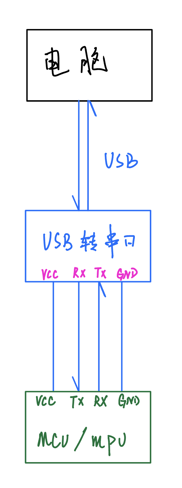

该项目为本人的一次课设，在很多项目开发中，都需要通过上位机来控制或者读取 MCU、MPU 中的数据。上位机和设备间的通信协议有串口、CAN、RS485 等等。本项目基于 python 编写，将串口获取到的数据显示在上位机中，并将数据以可视化图形显示出来。废话少说，上图！！！

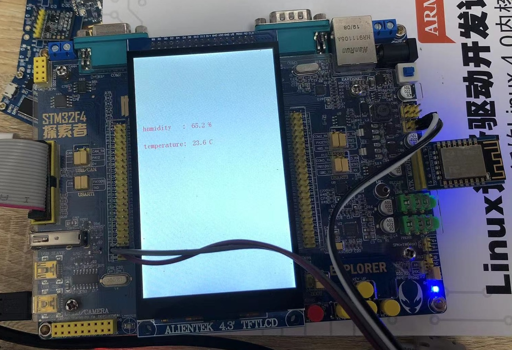

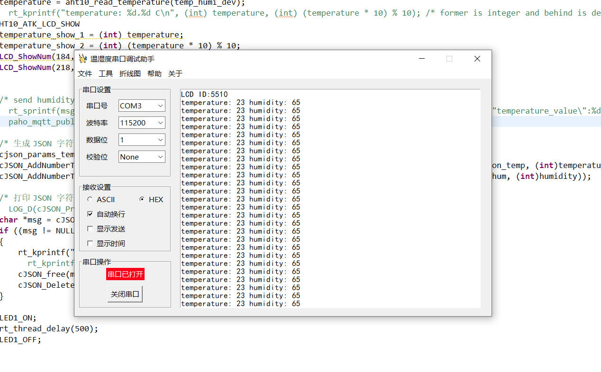

## 2. 功能简介


## 3. 开发过程


### 3.1 准备工作

本项目用到的库有 tkinter、pyserial、matplotlib、pyautogui、configparser、webbrowser 等，其中 pyserial 与 pyautogui 需要自行安装其余库皆是 python 自带库。如没有安装过这两个库可以使用以下命令安装。

```shell
pip install pyserial
pip install pyautogui
```


### 3.2 编写串口上位机界面

首先，先将上位机基本界面框架搭建好，此部分给出代码自行研究。

```python
from tkinter import *
from tkinter.messagebox import *

import ctypes


class zsh_serial:
    def __init__(self):
        self.window = Tk()  # 实例化出一个父窗口
        # self.com = serial.Serial()
        self.serial_combobox = None
        self.bound_combobox = None
        self.txt = None

    def ui(self):
        ############################################
        # 窗口配置
        ############################################
        # self.window = Tk()  # 实例化出一个父窗口
        self.window.title("温湿度串口调试助手")
        # self.window.iconbitmap(default='data\\COM.ico')  # 修改 logo
        width = self.window.winfo_screenwidth()
        height = self.window.winfo_screenheight()
        print(width, height)
        win = '{}x{}+{}+{}'.format(880, 500, width // 3, height // 5)  # {}x{} 窗口大小，+10 +10 定义窗口弹出时的默认展示位置
        self.window.geometry(win)
        self.window.resizable(False, False)

        # 调用api设置成由应用程序缩放
        ctypes.windll.shcore.SetProcessDpiAwareness(1)
        # 调用api获得当前的缩放因子
        ScaleFactor = ctypes.windll.shcore.GetScaleFactorForDevice(0)
        # 设置缩放因子
        self.window.tk.call('tk', 'scaling', ScaleFactor / 75)

        ############################################
        # 串口设置子菜单 1
        ############################################

        # 串口设置
        group_serial_set = LabelFrame(self.window, text="串口设置")
        group_serial_set.grid(row=0, padx=10, pady=10)

        serial_label = Label(group_serial_set, text="串口号")
        serial_label.grid(row=0, column=0, padx=10, pady=10, sticky=W)
        self.serial_combobox = ttk.Combobox(group_serial_set, width=8)
        # self.serial_combobox['value'] = zsh_serial.getSerialPort()
        self.serial_combobox.grid(row=0, column=1, padx=10, pady=10)

        bound_label_set = Label(group_serial_set, text="波特率")
        bound_label_set.grid(row=1, column=0)
        self.bound_combobox = ttk.Combobox(group_serial_set, width=8)
        self.bound_combobox['value'] = ("9600", "19200", "38400", "57600", "115200", "128000")
        self.bound_combobox.grid(row=1, column=1)

        databits_label = Label(group_serial_set, text="数据位")
        databits_label.grid(row=2, column=0, pady=10)
        databits_combobox = ttk.Combobox(group_serial_set, width=8)
        databits_combobox['value'] = ("1", "1.5", "2")
        databits_combobox.grid(row=2, column=1)

        checkbits_label = Label(group_serial_set, text="校验位")
        checkbits_label.grid(row=3, column=0)
        checkbits_combobox = ttk.Combobox(group_serial_set, width=8)
        checkbits_combobox['value'] = ("None", "Odd", "Even")
        checkbits_combobox.grid(row=3, column=1)

        xxx_label = Label(group_serial_set, text="   ")
        xxx_label.grid(row=4, column=0, pady=1)

        # 接收设置
        recv_set = LabelFrame(self.window, text="接收设置")
        recv_set.grid(row=1, padx=10)

        recv_set_v = IntVar()
        recv_set_radiobutton1 = Radiobutton(recv_set, text="ASCII", variable=recv_set_v, value=1)
        recv_set_radiobutton1.grid(row=0, column=0, sticky=W, padx=10)
        recv_set_radiobutton2 = Radiobutton(recv_set, text="HEX", variable=recv_set_v, value=2)
        recv_set_radiobutton2.grid(row=0, column=1, sticky=W, padx=10)

        recv_set_v1 = IntVar()
        recv_set_v2 = IntVar()
        recv_set_v3 = IntVar()
        recv_set_checkbutton1 = Checkbutton(recv_set, text="自动换行", variable=recv_set_v1, onvalue=1, offvalue=2)
        recv_set_checkbutton1.grid(row=1, column=0, padx=10)
        recv_set_checkbutton2 = Checkbutton(recv_set, text="显示发送", variable=recv_set_v2, onvalue=1, offvalue=2)
        recv_set_checkbutton2.grid(row=2, column=0, padx=10)
        recv_set_checkbutton3 = Checkbutton(recv_set, text="显示时间", variable=recv_set_v3, onvalue=1, offvalue=2)
        recv_set_checkbutton3.grid(row=3, column=0, padx=10)

        # 串口操作
        group_serial_event = LabelFrame(self.window, text="串口操作")
        group_serial_event.grid(row=2, padx=10, pady=10)

        self.serial_btn_flag_str = StringVar()
        self.serial_btn_flag_str.set("串口未打开")
        label_name = Label(group_serial_event, textvariable=self.serial_btn_flag_str, bg='#ff001a', fg='#ffffff')
        label_name.grid(row=0, column=0, padx=55, pady=2)

        self.serial_btn_str = StringVar()
        self.serial_btn_str.set("打开串口")
        serial_btn = Button(group_serial_event, textvariable=self.serial_btn_str)
        serial_btn.grid(row=1, column=0, padx=55, pady=10)

        # 数据显示
        self.txt = Text(self.window, width=70, height=26.5, font=("SimHei", 10))
        self.txt.grid(row=0, rowspan=3, column=1, padx=8, pady=10, sticky='s')

        # 串口子菜单设置初值
        self.bound_combobox.set(self.bound_combobox['value'][4])
        databits_combobox.set(databits_combobox['value'][0])
        checkbits_combobox.set(checkbits_combobox['value'][0])
        recv_set_v.set(2)
        recv_set_v1.set(1)
        recv_set_v2.set(2)
        recv_set_v3.set(2)

        ############################################
        # 配置tkinter样式
        ############################################
        # self.window.config(menu=menubar)

        ############################################
        # 退出检测
        ############################################
        def bye():
            self.window.destroy()

        self.window.protocol("WM_DELETE_WINDOW", bye)

        # 窗口循环显示
        self.window.mainloop()


if __name__ == "__main__":
    mySerial = zsh_serial()
    mySerial.ui()
```

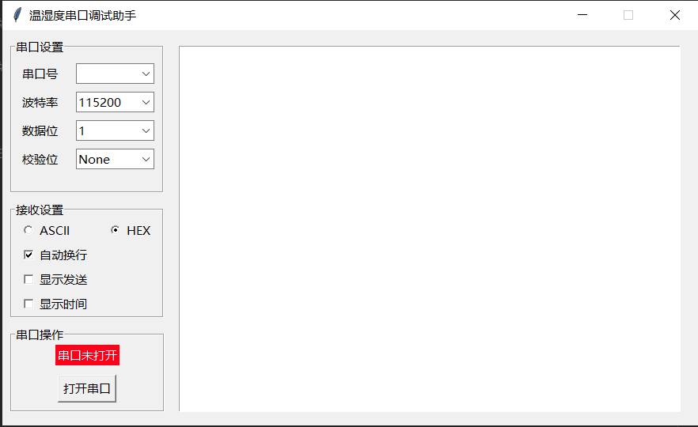

现在界面还是太简陋了，接下来增加 menu 菜单栏。这里用到了 ttk 子模块，因为 tkinter 没有下拉菜单控件，代码如下：

```python
from tkinter import ttk  # 导入ttk模块，因为Combobox下拉菜单控件在ttk中

# ... 略

    	############################################
        # menu菜单
        ############################################
        menubar = Menu(self.window)  # 创建一个顶级菜单
        menu = MENU(self.window)
        filemenu1 = Menu(menubar, tearoff=False)  # 在顶级菜单menubar下, 创建一个子菜单filemenu1
        filemenu2 = Menu(menubar, tearoff=False)  # 在顶级菜单menubar下, 创建一个子菜单filemenu2
        filemenu3 = Menu(menubar, tearoff=False)  # 在顶级菜单menubar下, 创建一个子菜单filemenu3
        menubar.add_cascade(label="文件", menu=filemenu1)  # 为子菜单filemenu1取个名字
        menubar.add_cascade(label="工具", menu=filemenu2)  # 为子菜单filemenu2取个名字
        menubar.add_cascade(label="折线图", menu=filemenu3)  # 为子菜单filemenu3取个名字
        menubar.add_command(label="帮助", command=menu.callback7)
        menubar.add_command(label="关于", command=menu.callback8)
        filemenu1.add_command(label="更新检测", command=menu.callback9)  # 为子菜单filemenu1添加选项，取名"更新检测"
        filemenu1.add_command(label="获取源码", command=menu.callback1)  # 为子菜单filemenu1添加选项，取名"获取源码"
        filemenu1.add_command(label="博客教程", command=menu.callback10)  # 为子菜单filemenu1添加选项，取名"博客教程"
        filemenu1.add_separator()  # 添加一条分割线
        filemenu1.add_command(label="退出", command=menu.callback2)  # 为子菜单filemenu1添加选项，取名"关闭"
        filemenu2.add_command(label="刷新串口", command=self.cleanSerial)  # 为子菜单filemenu2添加选项，取名"刷新串口"
        filemenu2.add_command(label="截图", command=menu.callback4)  # 为子菜单filemenu2添加选项，取名"截图"
        filemenu3.add_command(label="温度图", command=menu.callback5)  # 为子菜单filemenu2添加选项，取名"温度图"
        filemenu3.add_command(label="湿度图", command=menu.callback6)  # 为子菜单filemenu2添加选项，取名"湿度图"
        
 # ... 略
```

这一步完成后，是运行不了的，我们要为菜单栏增加回调函数。

```python
import webbrowser

class MENU:
    def __init__(self, init_window_name):
        self.init_window_name = init_window_name

    @staticmethod
    def callback1():
        print("--- 获取源码 ---")
        showwarning("warning", "Please follow the GPL3.0")
        webbrowser.open("https://github.com/Theo-s-Open-Source-Project")

    @staticmethod
    def callback2():
        print("--- 退出 ---")
        sys.exit()

    def callback3(self):
        print("--- 刷新串口 ---")

    @staticmethod
    def callback4():
        print("--- 截图 ---")
        # window_capture()
           
 # ... 略
```

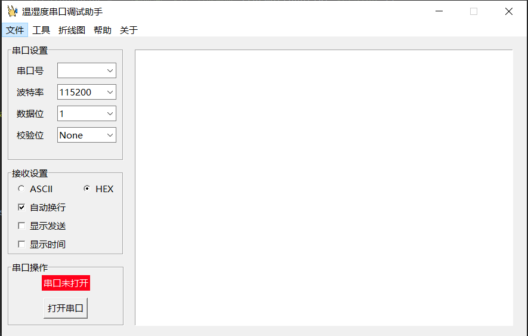

到此，我们的界面已经搭建完成了，接下来就是注入灵魂的时候，为其增加功能函数。


### 3.3 功能实现


#### 3.3.1 基本功能

在进行通信前，要先获取电脑可用串口进行连接，借助 pyserial 库的 `serial.tools.list_ports.comports()` 获取电脑目前所有串口号。

```python
    @staticmethod
    def getSerialPort():
        port = []
        portList = list(serial.tools.list_ports.comports())
        # print(portList)

        if len(portList) == 0:
            print("--- 无串口 ---")
            port.append('None')
        else:
            for comport in portList:
                # print(list(comport)[0])
                # print(list(comport)[1])
                port.append(list(comport)[0])
                pass
        return port
```

获取到串口号后，将其显示在 tkinter 的 combobox 控件中。

```python
self.serial_combobox['value'] = zsh_serial.getSerialPort()
```

接下来就是打开串口，这里不做详细讲解（如需要的话评论区留言🦄）给出具体实现代码。

```python
    def openSerial(self, port, bps, timeout):
        """
        打开串口
        :param port: 端口号
        :param bps: 波特率
        :param timeout: 超时时间
        :return: True or False
        """
        ser_flag = False
        try:
            # 打开串口
            self.com = serial.Serial(port, bps, timeout=timeout)
            if self.com.isOpen():
                ser_flag = True
                # threading.Thread(target=self.readSerial, args=(self.com,)).start()
                # print("Debug: 串口已打开\n")
            # else:
            #     print("Debug: 串口未打开")
        except Exception as e:
            print("error: ", e)
            error = "error: {}".format(e)
            showerror('error', error)
        return self.com, ser_flag
```

将其与打开串口 button 事件进行绑定，代码如下：

```python
 ... 
        self.serial_btn_str = StringVar()
        self.serial_btn_str.set("打开串口")
        serial_btn = Button(group_serial_event, textvariable=self.serial_btn_str, command=self.hit1)  # 添加点击事件
        serial_btn.grid(row=1, column=0, padx=55, pady=10)
 ...
    
    def hit1(self):
        """
        打开串口按钮回调
        """
        # print(self.com.isOpen())
        if self.com.isOpen():
            self.com.close()
            print("--- 串口未打开 ---")
            self.serial_btn_flag_str.set("串口未打开")
            self.serial_btn_str.set("打开串口")
        else:
            self.com, ser_flag = self.openSerial(self.serial_combobox.get(), self.bound_combobox.get(), None)
            if ser_flag:
                print("--- 串口已打开 ---")
                self.serial_btn_flag_str.set("串口已打开")
                self.serial_btn_str.set("关闭串口")
```

到此，一个串口调试助手的最基本功能就实现了，接下来就是让串口获取到的信息显示到上位机中的 txt 控件上。

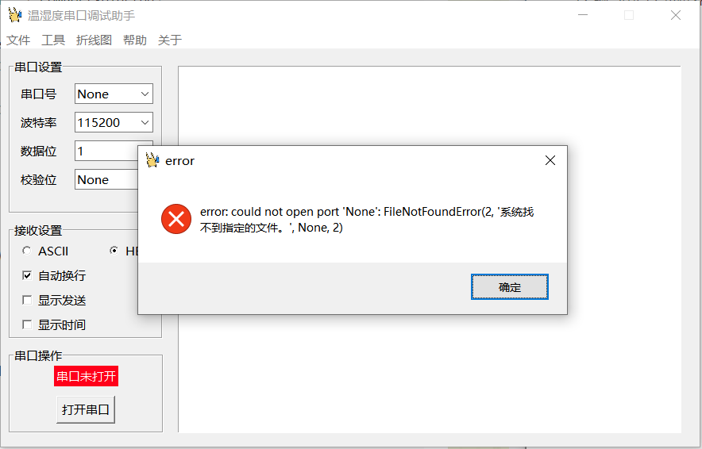

我们该如何实时获取并打印串口中的数据呢，这里使用一个线程不断的去读取。

```python
    def readSerial(self, com):
        """
        读取串口数据
        :return:
        """
        global serialData
        while True:
            if self.com.in_waiting:
                textSetial = self.com.read(self.com.in_waiting)
                serialData = textSetial
                # print(textSetial)
                self.txt.config(state=NORMAL)
                self.txt.insert(END, textSetial)
                self.txt.config(state=DISABLED)
            # print("Debug: thread_readSerial is running")
```

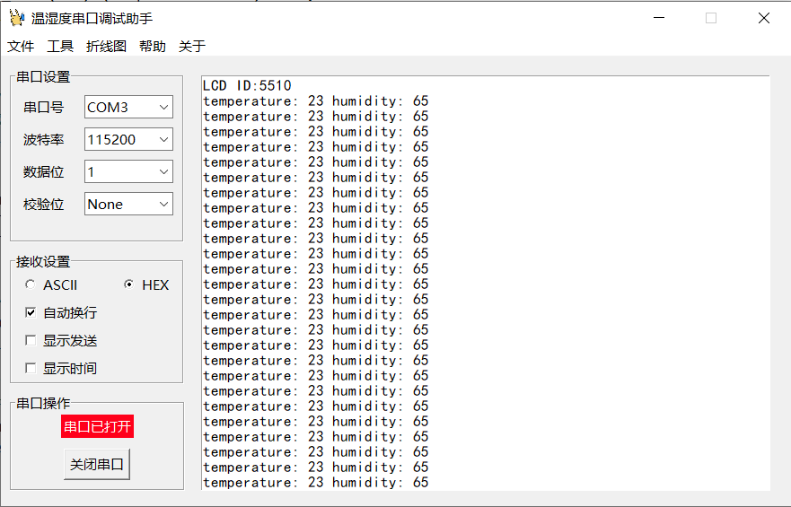

基本功能实现，但现在的上位机还是太单调了，接下来就是整活时间😋


#### 3.3.2 整活

在最开始时，我们创建了一行菜单栏，接下来为其注入灵魂！

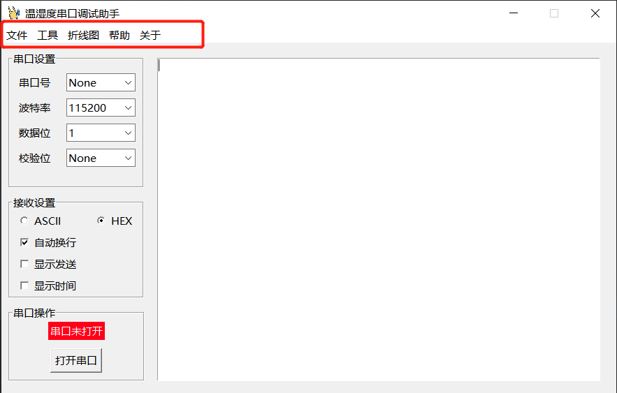

首先是这款上位机的重中之重 <font color="blue">**”折线图“**</font>（注：当前版本的折线图数据非串口获取到到**真实数据**，仅做功能演示！！）

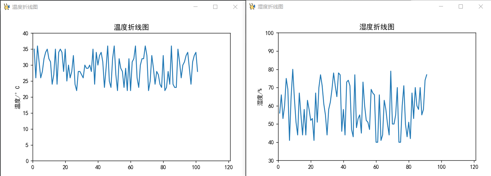

```python
    def createTempWindow(self):
        """
        创建新的窗口
        """
        new_window = self.window
        new_window.title("温度折线图")
        new_window.geometry("720x480")
        # Button(new_window,
        #        text="This is new window").pack()

        # 创建一个容器, 没有画布时的背景
        frame = Frame(new_window, bg="#ffffff")
        frame.place(x=0, y=0, width=720, height=480)
        plt.rcParams['font.sans-serif'] = ['SimHei']  # 用来正常显示中文标签
        fig = plt.figure(figsize=(6, 3.9), edgecolor='blue')
        # 定义刻度
        ax = fig.add_subplot(111)
        ax.set(xlim=[0, 121], ylim=[0, 40], title="温度折线图", ylabel='温度/°C')
        canvas = FigureCanvasTkAgg(fig, master=frame)
        canvas.draw()
        # 显示画布
        canvas.get_tk_widget().place(x=0, y=0)

        # 定义存储坐标的空数组
        self.i = 0
        self.x = []
        self.y = []

        def drawTemp():
            global tempData
            self.i += 1
            # time.sleep(1)
            ax.clear()
            ax.set(xlim=[0, 121], ylim=[0, 40], title="温度折线图", ylabel='温度/°C')
            t = self.i
            if t >= 120:
                bye()
            dtax = t
            self.x.append(dtax)
            # 温度数据处理
            """
            xxxxxxxxxxxxxxxxxxxxx
            """
            dtay = random.randint(22, 36)
            # print(dtay)
            self.y.append(dtay)
            ax.plot(self.x, self.y)
            canvas.draw()
            self.afterHandler = self.window.after(100, drawTemp)

        drawTemp()

        def bye():
            plt.close('all')
            new_window.destroy()
            self.window.mainloop()

        new_window.protocol("WM_DELETE_WINDOW", bye)

        # 窗口循环显示
        new_window.mainloop()
```

将其与菜单栏的回调进行绑定，这里加了一个专业版和社区版的识别函数（是不是有 B 格起来了😎）

```python
    @staticmethod
    def callback5():
        config = version.config()
        if config['power'] == 'Professional':
            print("--- 温度折线图 ---")
            new_win = zsh_serial()
            new_win.createTempWindow()
```

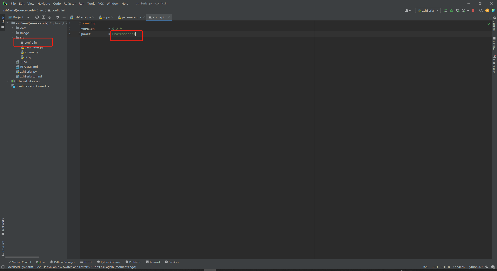

通过读取存放在 config.ini 中的 JSON 数据进行分析判断是专业版还是社区版来赋予访问折线图的权限。

```python
from configparser import ConfigParser

class version:
    @staticmethod
    def config():
        """
        获取配置文件
        :return: 读取到的配置文件信息
        """
        config = ConfigParser()
        config.read("src\\config.ini")
        cfg = dict(config.items("config"))  # 字符串转换为字典
        # print(cfg)
        # print(cfg['version'])
        return cfg
```

社区版会弹出提示框，这里放的二维码是俺的博客地址。实现方法也非常简单，简单来说就是新建一个窗口并显示。这里需要注意的是 tkinter 库的 PhotoImage 函数只能显示 gif 格式的图片，所以需要进行一个图片格式转换。


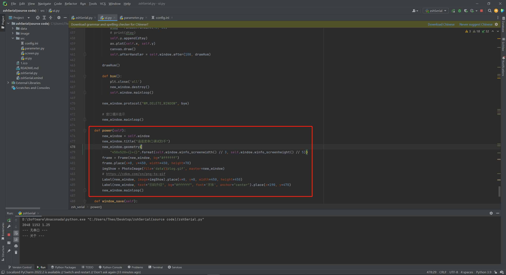

保存串口信息功能（如下图），实现方法其实很简单，因为在前面将 txt 窗口设为只读模式，所以 copy 串口打印信息时，需要将 txt 控件解除只读，为了保证串口数据不被人为的误改， get 数据后再将其恢复为只读模式。将获取到的数据保存到 txt 文件中，默认保存路径位桌面，这里用到了 `os.getlogin()` 获取系统用户名。

```python
    def window_save(self):
        self.txt.config(state=NORMAL)
        result = self.txt.get("1.0", "end")
        self.txt.config(state=DISABLED)

        with open('C:\\Users\\{}\\Desktop\\zshSerial.txt'.format(os.getlogin()), 'w') as f:
            for text in result:
                f.write(text)
```

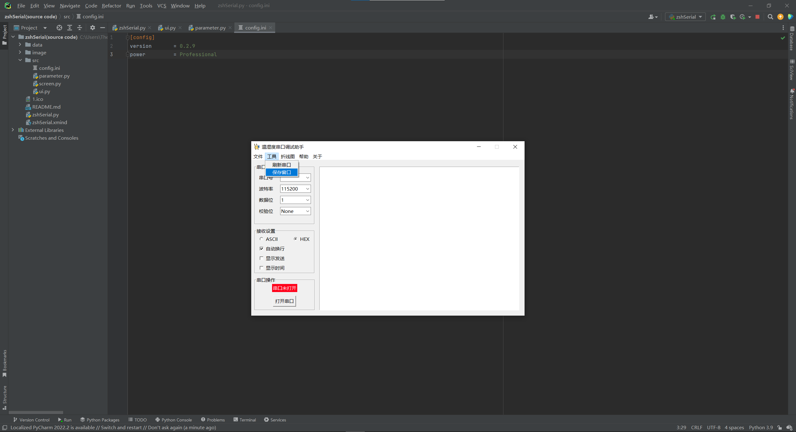

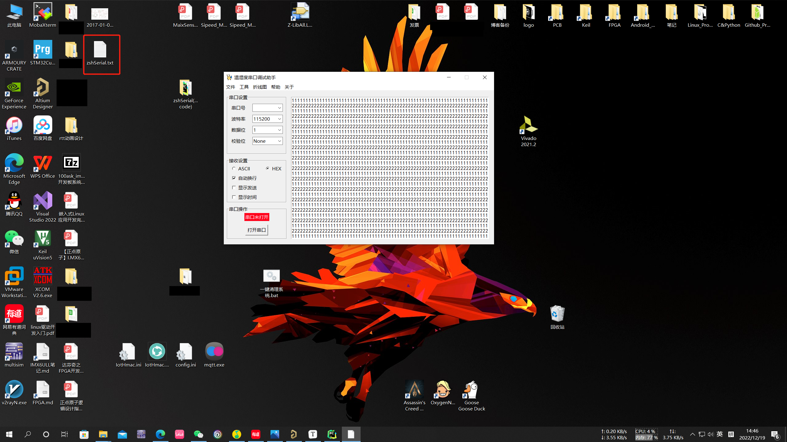

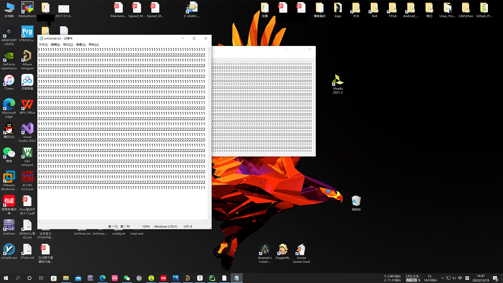

还记得上面有提到过的更新检测吗（~~好像没有提到过~~ bushi 😎），通过对比服务器上的版本信息进行判断，如果有时间下个版本会更新在线升级（咕咕~🕊）。

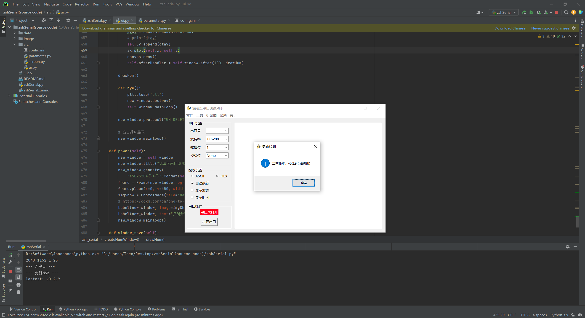

```python
    @staticmethod
    def callback9():
        print("--- 更新检测 ---")
        import requests
        ver = requests.get('http://xxx.xxx.xxx.xx/download/open-source-project/zshSerial/version.txt')
        print(ver.text)
        config = version.config()
        if "lastest: v{}".format(config['version']) == ver.text:
            versionCheck = "当前版本：v{} 为最新版".format(config['version'])
            showinfo('更新检测', versionCheck)
        else:
            versionCheck = "当前版本：v{} 版本过低，请及时更新".format(config['version'])
            showwarning('更新检测', versionCheck)
            version.update()
```

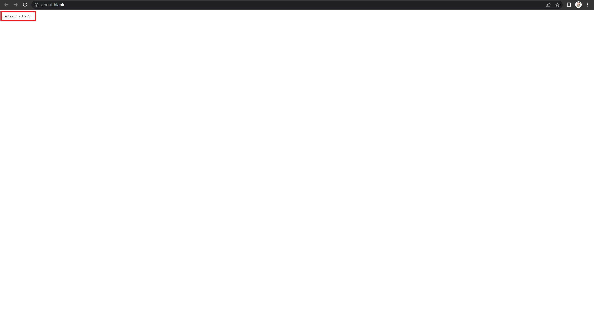


### 3.4 打包 exe 可执行文件


首先，我们从 GitHub 仓库将源码克隆到本地。

```git
git clone https://github.com/Theo-s-Open-Source-Project/zshSerial.git
```
克隆下来的文件夹结构如下：

```
.
├── data  			//存放一些数据
│   ├──COM.png
│   ├──blog.gif
│   ├──xxx.ico
│   ├──readme.txt
├── image           //README文件的图片
├── src             //zshSerial库
│   ├──__pycache__
│   ├──config.ini
│   ├──parameter.py
│   ├──ui.py
├── .gitignore       
├── LICENSE       
├── README.md       //README文档
├── zshSerial.py    //main函数   
```

准备好后，（这里使用 pyinstaller 打包）打开终端，输入以下命令进行打包。

```python
pyinstaller -D -w -i 1.ico zshSerial.py
```

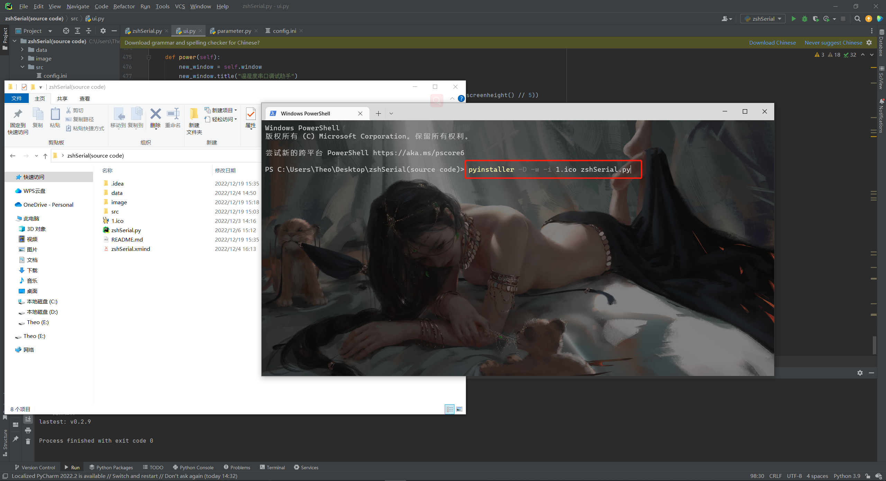

打包好的程序存放在当前目录的 dist 文件夹下，用 pyinstaller 打包的文件夹有些许大，这里有几种方法可以压缩（自行百度），but 俺懒得尝试了，使用最简单粗暴的方法 delete!!! 哈哈哈。确保 exe 文件有在运行，选中所有的 .dll 文件 delete 即可。

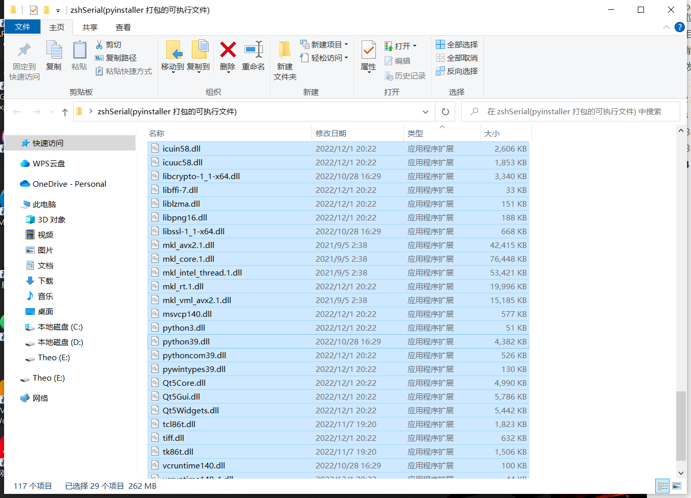
