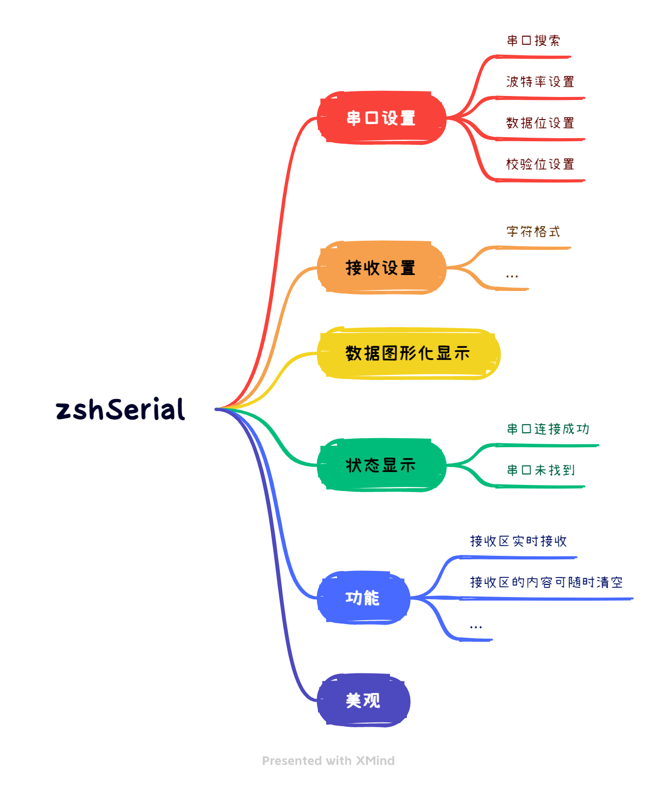

# 【Python】从零开始制作温湿度串口上位机


* [1\. 项目介绍](#1-项目介绍)
* [2\. 功能简介](#2-功能简介)
* [3\. 开发过程](#3-开发过程)
  * [3\.1 准备工作](#31-准备工作)
  * [3\.2 编写串口上位机界面](#32-编写串口上位机界面)
  * [3\.3 功能实现](#33-功能实现)


## 1. 项目介绍


​		该项目为本人的一次课设，在很多项目开发中，都需要通过上位机来控制或者读取 MCU、MPU 中的数据。上位机和设备间的通信协议有串口、CAN、RS485 等等。本项目基于 python 编写，将串口获取到的数据显示在上位机中，并将数据以可视化图形显示出来。废话少说，上图！！！


## 2. 功能简介




## 3. 开发过程


### 3.1 准备工作

​		本项目用到的库有 tkinter、pyserial、matplotlib、pyautogui、configparser、webbrowser 等，其中 pyserial 与 pyautogui 需要自行安装其余库皆是 python 自带库。如没有安装过这两个库可以使用以下命令安装。

```shell
pip install pyserial
pip install pyautogui
```


### 3.2 编写串口上位机界面

​		首先，先将上位机基本界面框架搭建好，此部分给出代码自行研究。

```python
from tkinter import *
from tkinter.messagebox import *

import ctypes


class zsh_serial:
    def __init__(self):
        self.window = Tk()  # 实例化出一个父窗口
        # self.com = serial.Serial()
        self.serial_combobox = None
        self.bound_combobox = None
        self.txt = None

    def ui(self):
        ############################################
        # 窗口配置
        ############################################
        # self.window = Tk()  # 实例化出一个父窗口
        self.window.title("温湿度串口调试助手")
        # self.window.iconbitmap(default='data\\COM.ico')  # 修改 logo
        width = self.window.winfo_screenwidth()
        height = self.window.winfo_screenheight()
        print(width, height)
        win = '{}x{}+{}+{}'.format(880, 500, width // 3, height // 5)  # {}x{} 窗口大小，+10 +10 定义窗口弹出时的默认展示位置
        self.window.geometry(win)
        self.window.resizable(False, False)

        # 调用api设置成由应用程序缩放
        ctypes.windll.shcore.SetProcessDpiAwareness(1)
        # 调用api获得当前的缩放因子
        ScaleFactor = ctypes.windll.shcore.GetScaleFactorForDevice(0)
        # 设置缩放因子
        self.window.tk.call('tk', 'scaling', ScaleFactor / 75)

        ############################################
        # 串口设置子菜单 1
        ############################################

        # 串口设置
        group_serial_set = LabelFrame(self.window, text="串口设置")
        group_serial_set.grid(row=0, padx=10, pady=10)

        serial_label = Label(group_serial_set, text="串口号")
        serial_label.grid(row=0, column=0, padx=10, pady=10, sticky=W)
        self.serial_combobox = ttk.Combobox(group_serial_set, width=8)
        # self.serial_combobox['value'] = zsh_serial.getSerialPort()
        self.serial_combobox.grid(row=0, column=1, padx=10, pady=10)

        bound_label_set = Label(group_serial_set, text="波特率")
        bound_label_set.grid(row=1, column=0)
        self.bound_combobox = ttk.Combobox(group_serial_set, width=8)
        self.bound_combobox['value'] = ("9600", "19200", "38400", "57600", "115200", "128000")
        self.bound_combobox.grid(row=1, column=1)

        databits_label = Label(group_serial_set, text="数据位")
        databits_label.grid(row=2, column=0, pady=10)
        databits_combobox = ttk.Combobox(group_serial_set, width=8)
        databits_combobox['value'] = ("1", "1.5", "2")
        databits_combobox.grid(row=2, column=1)

        checkbits_label = Label(group_serial_set, text="校验位")
        checkbits_label.grid(row=3, column=0)
        checkbits_combobox = ttk.Combobox(group_serial_set, width=8)
        checkbits_combobox['value'] = ("None", "Odd", "Even")
        checkbits_combobox.grid(row=3, column=1)

        xxx_label = Label(group_serial_set, text="   ")
        xxx_label.grid(row=4, column=0, pady=1)

        # 接收设置
        recv_set = LabelFrame(self.window, text="接收设置")
        recv_set.grid(row=1, padx=10)

        recv_set_v = IntVar()
        recv_set_radiobutton1 = Radiobutton(recv_set, text="ASCII", variable=recv_set_v, value=1)
        recv_set_radiobutton1.grid(row=0, column=0, sticky=W, padx=10)
        recv_set_radiobutton2 = Radiobutton(recv_set, text="HEX", variable=recv_set_v, value=2)
        recv_set_radiobutton2.grid(row=0, column=1, sticky=W, padx=10)

        recv_set_v1 = IntVar()
        recv_set_v2 = IntVar()
        recv_set_v3 = IntVar()
        recv_set_checkbutton1 = Checkbutton(recv_set, text="自动换行", variable=recv_set_v1, onvalue=1, offvalue=2)
        recv_set_checkbutton1.grid(row=1, column=0, padx=10)
        recv_set_checkbutton2 = Checkbutton(recv_set, text="显示发送", variable=recv_set_v2, onvalue=1, offvalue=2)
        recv_set_checkbutton2.grid(row=2, column=0, padx=10)
        recv_set_checkbutton3 = Checkbutton(recv_set, text="显示时间", variable=recv_set_v3, onvalue=1, offvalue=2)
        recv_set_checkbutton3.grid(row=3, column=0, padx=10)

        # 串口操作
        group_serial_event = LabelFrame(self.window, text="串口操作")
        group_serial_event.grid(row=2, padx=10, pady=10)

        self.serial_btn_flag_str = StringVar()
        self.serial_btn_flag_str.set("串口未打开")
        label_name = Label(group_serial_event, textvariable=self.serial_btn_flag_str, bg='#ff001a', fg='#ffffff')
        label_name.grid(row=0, column=0, padx=55, pady=2)

        self.serial_btn_str = StringVar()
        self.serial_btn_str.set("打开串口")
        serial_btn = Button(group_serial_event, textvariable=self.serial_btn_str)
        serial_btn.grid(row=1, column=0, padx=55, pady=10)

        # 数据显示
        self.txt = Text(self.window, width=70, height=26.5, font=("SimHei", 10))
        self.txt.grid(row=0, rowspan=3, column=1, padx=8, pady=10, sticky='s')

        # 串口子菜单设置初值
        self.bound_combobox.set(self.bound_combobox['value'][4])
        databits_combobox.set(databits_combobox['value'][0])
        checkbits_combobox.set(checkbits_combobox['value'][0])
        recv_set_v.set(2)
        recv_set_v1.set(1)
        recv_set_v2.set(2)
        recv_set_v3.set(2)

        ############################################
        # 配置tkinter样式
        ############################################
        # self.window.config(menu=menubar)

        ############################################
        # 退出检测
        ############################################
        def bye():
            self.window.destroy()

        self.window.protocol("WM_DELETE_WINDOW", bye)

        # 窗口循环显示
        self.window.mainloop()


if __name__ == "__main__":
    mySerial = zsh_serial()
    mySerial.ui()
```


​		现在界面还是太简陋了，接下来增加 menu 菜单栏。这里用到了 ttk 子模块，因为 tkinter 没有下拉菜单控件，代码如下：

```python
from tkinter import ttk  # 导入ttk模块，因为Combobox下拉菜单控件在ttk中

# ... 略

    	############################################
        # menu菜单
        ############################################
        menubar = Menu(self.window)  # 创建一个顶级菜单
        menu = MENU(self.window)
        filemenu1 = Menu(menubar, tearoff=False)  # 在顶级菜单menubar下, 创建一个子菜单filemenu1
        filemenu2 = Menu(menubar, tearoff=False)  # 在顶级菜单menubar下, 创建一个子菜单filemenu2
        filemenu3 = Menu(menubar, tearoff=False)  # 在顶级菜单menubar下, 创建一个子菜单filemenu3
        menubar.add_cascade(label="文件", menu=filemenu1)  # 为子菜单filemenu1取个名字
        menubar.add_cascade(label="工具", menu=filemenu2)  # 为子菜单filemenu2取个名字
        menubar.add_cascade(label="折线图", menu=filemenu3)  # 为子菜单filemenu3取个名字
        menubar.add_command(label="帮助", command=menu.callback7)
        menubar.add_command(label="关于", command=menu.callback8)
        filemenu1.add_command(label="更新检测", command=menu.callback9)  # 为子菜单filemenu1添加选项，取名"更新检测"
        filemenu1.add_command(label="获取源码", command=menu.callback1)  # 为子菜单filemenu1添加选项，取名"获取源码"
        filemenu1.add_command(label="博客教程", command=menu.callback10)  # 为子菜单filemenu1添加选项，取名"博客教程"
        filemenu1.add_separator()  # 添加一条分割线
        filemenu1.add_command(label="退出", command=menu.callback2)  # 为子菜单filemenu1添加选项，取名"关闭"
        filemenu2.add_command(label="刷新串口", command=self.cleanSerial)  # 为子菜单filemenu2添加选项，取名"刷新串口"
        filemenu2.add_command(label="截图", command=menu.callback4)  # 为子菜单filemenu2添加选项，取名"截图"
        filemenu3.add_command(label="温度图", command=menu.callback5)  # 为子菜单filemenu2添加选项，取名"温度图"
        filemenu3.add_command(label="湿度图", command=menu.callback6)  # 为子菜单filemenu2添加选项，取名"湿度图"
        
 # ... 略
```

​		这一步完成后，是运行不了的，我们要为菜单栏增加回调函数。

```python
import webbrowser

class MENU:
    def __init__(self, init_window_name):
        self.init_window_name = init_window_name

    @staticmethod
    def callback1():
        print("--- 获取源码 ---")
        showwarning("warning", "Please follow the GPL3.0")
        webbrowser.open("https://github.com/Theo-s-Open-Source-Project")

    @staticmethod
    def callback2():
        print("--- 退出 ---")
        sys.exit()

    def callback3(self):
        print("--- 刷新串口 ---")

    @staticmethod
    def callback4():
        print("--- 截图 ---")
        # window_capture()
           
 # ... 略
```


​		到此，我们的界面已经搭建完成了，接下来就是注入灵魂的时候，为其增加功能函数。


### 3.3 功能实现

​		<font color="blue"> **咕咕几天，马上更新** </font>
